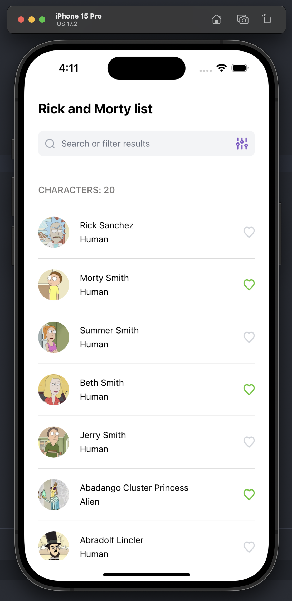

# Rick and Morty mobile App

### Video

- 

## Step by step to run the App

- Install dependencies with:
```npm run install```

- If you're going to run the App on an iOS emulator, you have to excute on ios directory:
```pod install```

- Then you can execute:
```npm run ios``` o ```npm run android``` and it'll open the metro on another terminal.


### Screens

<p>List of Characters</p>


<p>List with liked Characters</p>


<p>Search filters</p>


<p>Search filters with other button pressed</p>


<p>Alien search results</p>


<p>List of starred Characters</p>


<p>Detail of Character</p>


<p>Add comment option</p>


<p>Detail of Character with comment</p>

